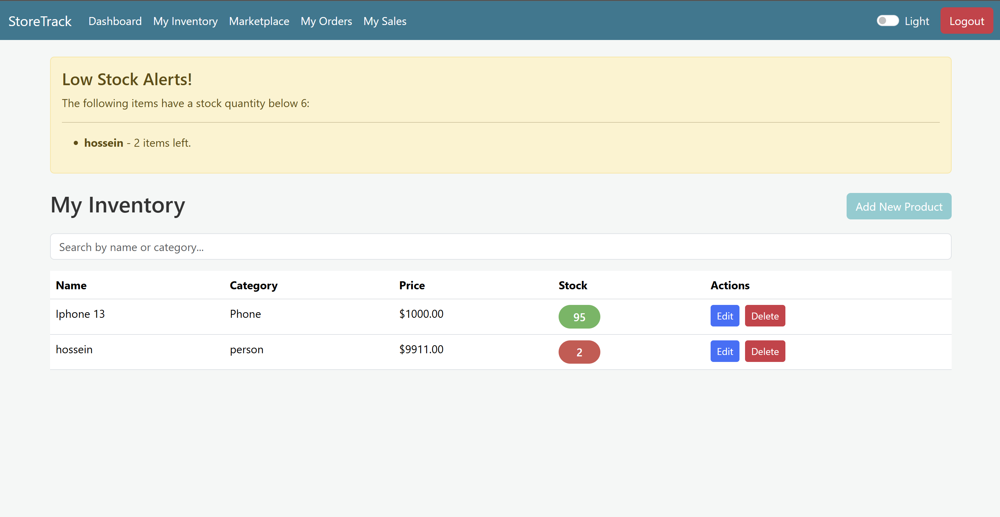
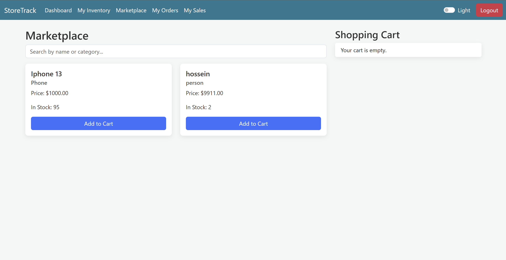
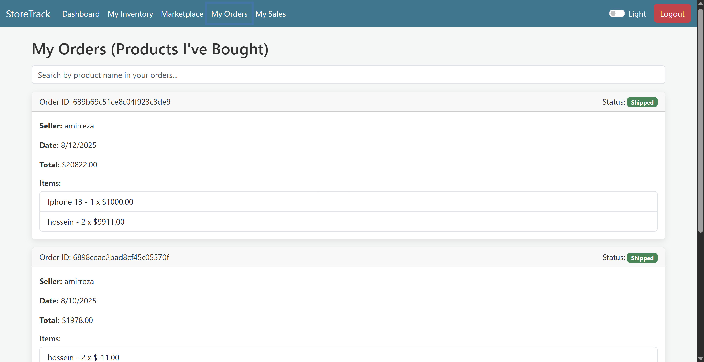
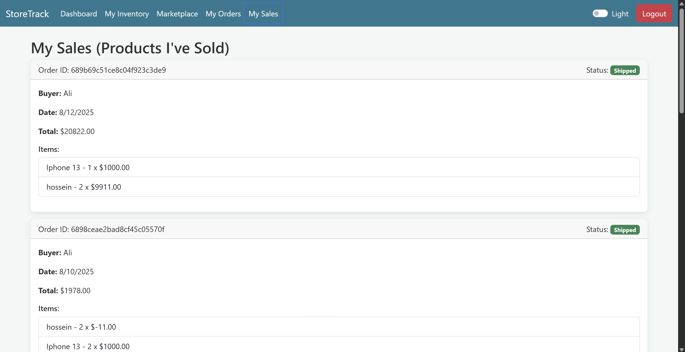
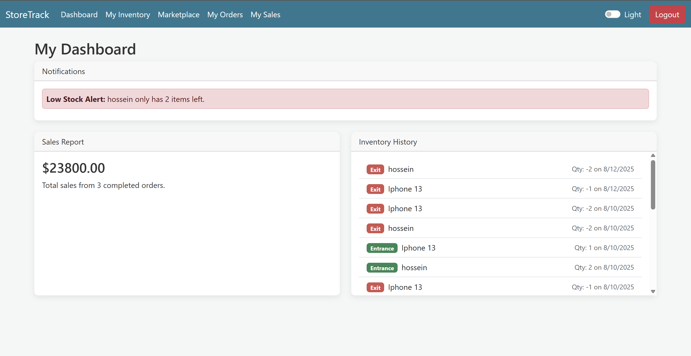
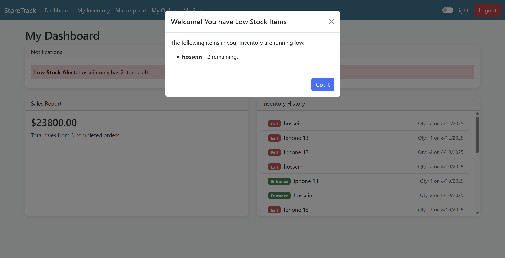

StoreTrack: Peer-to-Peer Inventory & Marketplace
StoreTrack is a full-stack web application designed as a peer-to-peer inventory and marketplace system. It empowers every user to manage their own product inventory, list items for sale, and purchase products from other users in a seamless, modern interface.
This project is built with a focus on clean architecture, robust features, and a great user experience, demonstrating a complete development cycle from back-end logic to front-end interactivity.
Features
Full User Authentication: Secure user registration and login using JSON Web Tokens (JWT).
Personal Inventory Management: Each user gets a dedicated "My Inventory" page to add, edit, and delete their own products. Stock quantities can be updated manually.

Dynamic Marketplace: A global marketplace to browse and purchase products listed by all other users. Includes search and filtering capabilities.

Interactive Shopping Cart: Users can add items to a cart, adjust quantities, and remove items before a simple, one-click checkout process.
Complete Order Management:
My Orders: A page to view the status and details of all orders a user has placed.

My Sales: A page for users to manage the orders they have received, including updating the order status (e.g., from "Pending" to "Shipped").

Automated Stock Control: Stock is automatically decremented when a sale is made and automatically restocked if a seller cancels an order.
Personal Dashboard & Reporting:

A comprehensive dashboard showing total sales figures.
A detailed log of all inventory history (entrances and exits).
Low-stock alerts for items with fewer than 6 units remaining, including a one-time notification modal upon login.

Technology Stack
Back-End: Node.js, Express.js
Front-End: React, TypeScript, Bootstrap
Database: MongoDB with Mongoose
Authentication: JSON Web Tokens (JWT)
Containerization: Docker, Docker Compose
Getting Started
Follow these instructions to get the project running on your local machine for development and testing purposes.
Prerequisites
You must have the following software installed on your machine:
Node.js (which includes npm)
MongoDB (or a MongoDB Atlas account)
Docker (Optional, for containerized setup)
Installation
1. Clone the Repository
code
Bash    
git clone <your-repository-url>
cd storetrack
2. Set Up the Back-End
The back-end server handles all API logic and database communication.
code
Bash
# Navigate to the backend directory
cd backend

# Install dependencies
npm install

# Create an environment variables file
# On Mac/Linux:
cp .env.example .env
# On Windows:
copy .env.example .env
Now, open the newly created .env file and fill in your configuration details.
code
Env
# Your MongoDB connection string
# For a local install:
MONGO_URI=mongodb://localhost:27017/storetrack
# For a cloud instance (Atlas):
# MONGO_URI=mongodb+srv://<username>:<password>@cluster...

# Your secret key for signing JWTs (use a long, random string)
JWT_SECRET=your-super-secret-and-long-random-string-for-jwt
Important: You must run the back-end and front-end in two separate terminal windows.
Start the Back-End Server:
code
Bash
# This will start the server and watch for changes
nodemon server.js

# If you don't have nodemon, use:
# node server.js
The server will be running on http://localhost:5000.
3. Set Up the Front-End
In a new terminal window, set up the React application.
code
Bash
# Navigate to the frontend directory from the root
cd frontend

# Install dependencies
npm install

# Start the React development server
npm start
The application will automatically open in your browser at http://localhost:3000.
API Endpoints
All protected routes require a Bearer <token> in the Authorization header.
Authentication (/api/auth)
Method	Endpoint	Description
POST	/register	Create a new user account.
POST	/login	Log in and receive a JWT.

Inventory (/api/inventory)
Method	Endpoint	Description	Protected
GET	/my-products	Get all products owned by the user.	Yes
POST	/my-products	Add a new product to inventory.	Yes
PUT	/my-products/:id	Edit the details of an owned product.	Yes
DELETE	/my-products/:id	Delete an owned product.	Yes
Marketplace (/api/marketplace)
Method	Endpoint	Description	Protected
GET	/products	Get all products (excluding the user's own).	Yes
GET	/products/:id	View a specific product's details.	Yes
Orders (/api/orders)
Method	Endpoint	Description	Protected
POST	/	Create a new order (checkout).	Yes
GET	/placed	Get all orders the user has placed (bought).	Yes
GET	/received	Get all orders placed on user's products (sold).	Yes
PUT	/received/:id	Update the status of a received order.	Yes
Reports (/api/reports)
Method	Endpoint	Description	Protected
GET	/my-sales	Get total sales figures for owned products.	Yes
GET	/my-inventory-history	Get a log of all stock changes.	Yes
GET	/my-low-stock	Get all products with stock below 6.	Yes